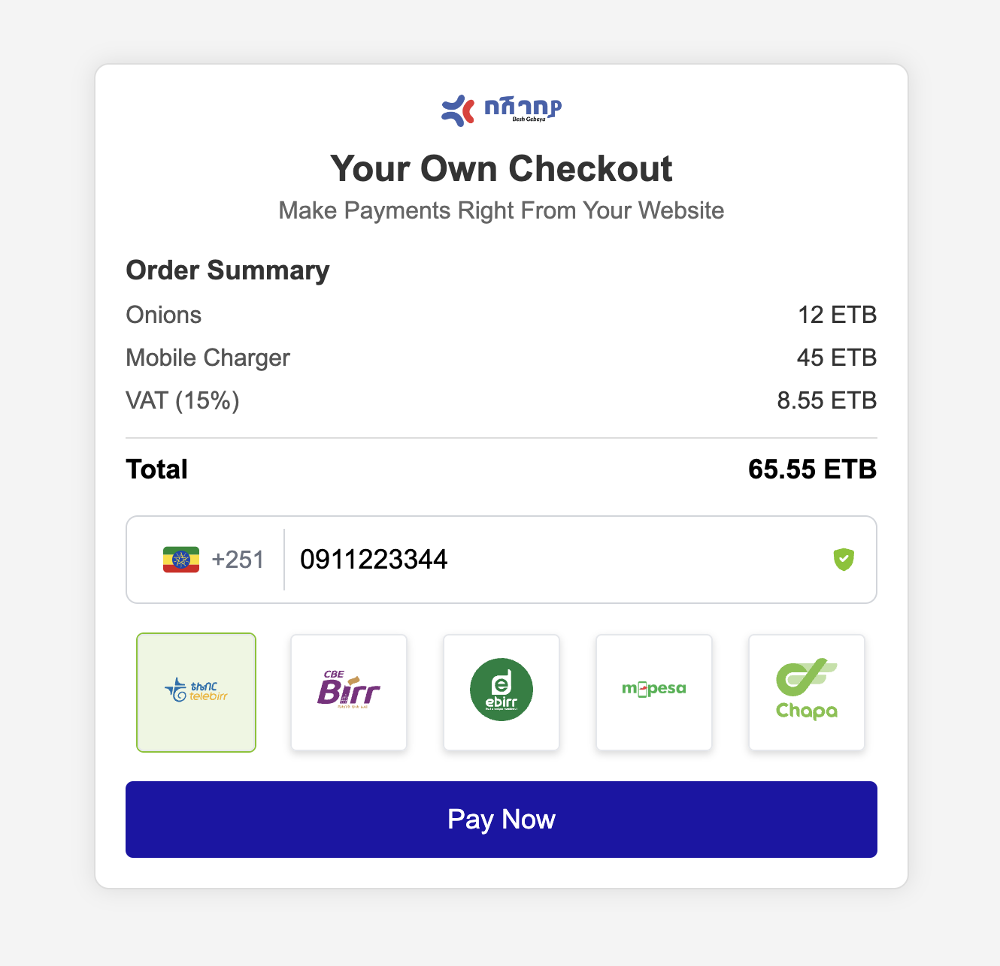

# Chapa Inline.js

This JavaScript module/wrapper provides an easy way to integrate [Chapa's direct charges](https://developer.chapa.co/charge/authorize-payments) into your web application. The `ChapaCheckout` class dynamically renders the payment form, handles user interactions, and processes payments through Chapa's API.


## Features

- **Dynamic Payment Form**: Renders a customizable payment form, including phone number input and payment method selection.
- **Payment Methods**: Supports multiple payment methods, including Telebirr, CBE Birr, Ebirr, Mpesa, and others via Chapa.
- **Mobile Number Validation**: Validates Ethiopian phone numbers for the selected payment method. It automatically strips common prefixes like `0`, `251`, or `+251` for accurate validation.
- **Customizable Styles**: Easily apply custom styles to match your application's design, including customizable button text.
- **Callback and Return URLs**: Supports custom callback and return URLs for handling payment results.
- **Success and Failure Callbacks**: Allows you to define custom behaviors upon successful payment or payment failure.
- **Popup Handling**: Displays a customizable popup upon successful payment, with the option to trigger additional actions when the popup is closed.
- **Pre-filled Phone Numbers**: Option to prefill phone numbers in the payment form.
- **Show/Hide Payment Method Names**: Control whether the names of payment methods are displayed alongside their icons.

## Getting Started

### Option 1: Using the Hosted Script

You can include the Chapa `inline.js` directly in your HTML by loading it from Chapa's CDN:

```html
<script src="https://js.chapa.co/v1/inline.js"></script>
```

### Option 2: Installing via npm

If you prefer to manage dependencies through npm, you can install the Chapa inline script as a package:

```bash
npm install @chapa_et/inline.js
```

Then, you can import and use it in your JavaScript file:

```javascript
import ChapaCheckout from '@chapa_et/inline.js';

const chapa = new ChapaCheckout({
    publicKey: 'YOUR_PUBLIC_KEY_HERE',
    amount: '100',
    currency: 'ETB',
    availablePaymentMethods: ['telebirr', 'cbebirr', 'ebirr', 'mpesa', 'chapa'],
    customizations: {
        buttonText: 'Pay Now',
        styles: `
            .chapa-pay-button { 
                background-color: #4CAF50; 
                color: white;
            }
        `
    },
    callbackUrl: 'https://yourdomain.com/callback',
    returnUrl: 'https://yourdomain.com/success',
});

chapa.initialize('chapa-inline-form');
```

## Usage

1. **Create an HTML Container**:

   In your HTML file, create a container where the payment form will be rendered:

   ```html
   <div id="chapa-inline-form"></div>
   ```

2. **Initialize ChapaCheckout**:

   Create a new instance of the `ChapaCheckout` class and pass in your configuration options:

   ```javascript
   const chapa = new ChapaCheckout({
       publicKey: 'YOUR_PUBLIC_KEY_HERE',
       amount: '100',
       currency: 'ETB',
       availablePaymentMethods: ['telebirr', 'cbebirr', 'ebirr', 'mpesa', 'chapa'],
       customizations: {
           buttonText: 'Pay Now',
           styles: `
               .chapa-pay-button { 
                   background-color: #4CAF50; 
                   color: white;
               }
           `
       },
       callbackUrl: 'https://yourdomain.com/callback',
       returnUrl: 'https://yourdomain.com/success',
   });

   chapa.initialize('chapa-inline-form');
   ```

3. **Handle Payment Submission**:

   The payment process is triggered when the user clicks the "Pay Now" button. The `ChapaCheckout` class will handle the payment process, including validation and API requests.

## Examples

To help you get started quickly, the following example implementations are provided in the `examples/` folder:


### 1. Checkout Example - `examples/checkout.html`




This example demonstrates a simple e-commerce checkout integration using Chapa's inline payment gateway. It includes a basic order summary with a pre-filled phone number.

- **File Location**: [`examples/checkout.html`](examples/checkout.html)
- **Features**:
  - Pre-configured order summary.
  - Pre-filled phone number in the payment form.
  - Easy integration with minimal configuration.

### 2. Custom Example - `examples/custom.html`


This example demonstrates how to create a custom payment form using the `ChapaCheckout` class. You can customize the button text, styles, and payment methods.

- **File Location**: [`examples/custom.html`](examples/custom.html)
- **Features**:
  - Customizable button text and styles.
  - Manual payment initiation.
  - Custom callback and return URLs.


### Running the Examples

To view the examples, simply open the HTML files in your web browser:

- **Custom Example**: Open `examples/custom.html` in your browser.
- **Checkout Example**: Open `examples/checkout.html` in your browser.

## Configuration Options

- `publicKey`: Your Chapa public key (required).
- `amount`: The amount to be paid (required).
- `currency`: The currency for the transaction (default: `ETB`).
- `availablePaymentMethods`: An array of available payment methods (default: `['telebirr', 'cbebirr', 'ebirr', 'mpesa']`).
- `customizations`: An object containing custom styles and button text.
  - `buttonText`: The text displayed on the payment button.
  - `styles`: Custom CSS styles to apply to the payment form.
- `callbackUrl`: The URL to which Chapa will send the transaction results.
- `returnUrl`: The URL to which the user will be redirected after the payment is completed.
- `showFlag`: Boolean to determine if the country flag should be shown (default: `true`).
- `showPaymentMethodsNames`: Boolean to determine if payment method names should be displayed (default: `true`).
- `onSuccessfulPayment`: A callback function that is executed upon successful payment.
- `customizations.successMessage`: A custom message to show on successful payment.
- `onPaymentFailure`: A callback function that is executed if the payment fails.
- `onClose`: A callback function that is executed when the payment popup is closed.

## License

This project is licensed under the [MIT License.](LICENSE)

---

For more information on Chapa's payment API, please refer to the [Chapa API Documentation](https://developer.chapa.co/docs/).

